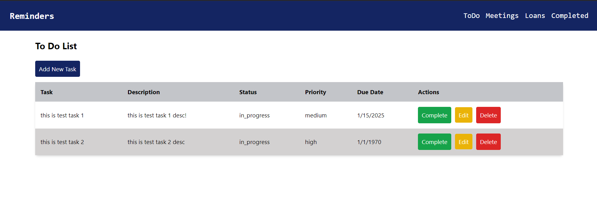

# Laravel API Project 🚀

Welcome to the **Laravel API Project**! 🎉 This application is built with **Laravel** to expose APIs. Below are the steps to get started quickly, along with some helpful tips to make the process smooth. Let's get you up and running! 💻

---

## 🛠️ **Requirements**

Before you begin, ensure you have the following tools installed:

- **PHP >= 8.0** 🔧
- **Composer** 📦
- **Laravel >= 9.x** ⚡
- **MySQL** (or any other preferred database) 🗄️

---

## 🚀 **Getting Started**

### 1. Clone the Repository

To start, **clone the repository** to your local machine:

