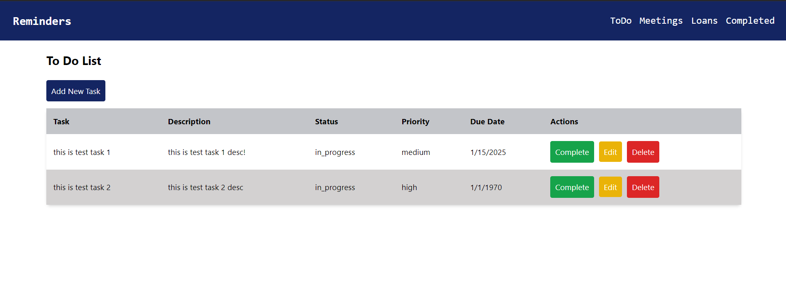

# todo-frontend



## Overview
This project is a **To-Do List Application** that allows users to manage tasks, meetings, and loans. The front-end is built with **Vue.js** and connects to a back-end API for task, meeting, and loan management.

---

## Project Setup

### Prerequisites
Before you begin, ensure you have **Node.js** and **npm** installed on your machine.

- [Download Node.js](https://nodejs.org/en/)

### Install Dependencies

To set up the project, follow these steps:

1. Clone the repository:
   ```bash
  
